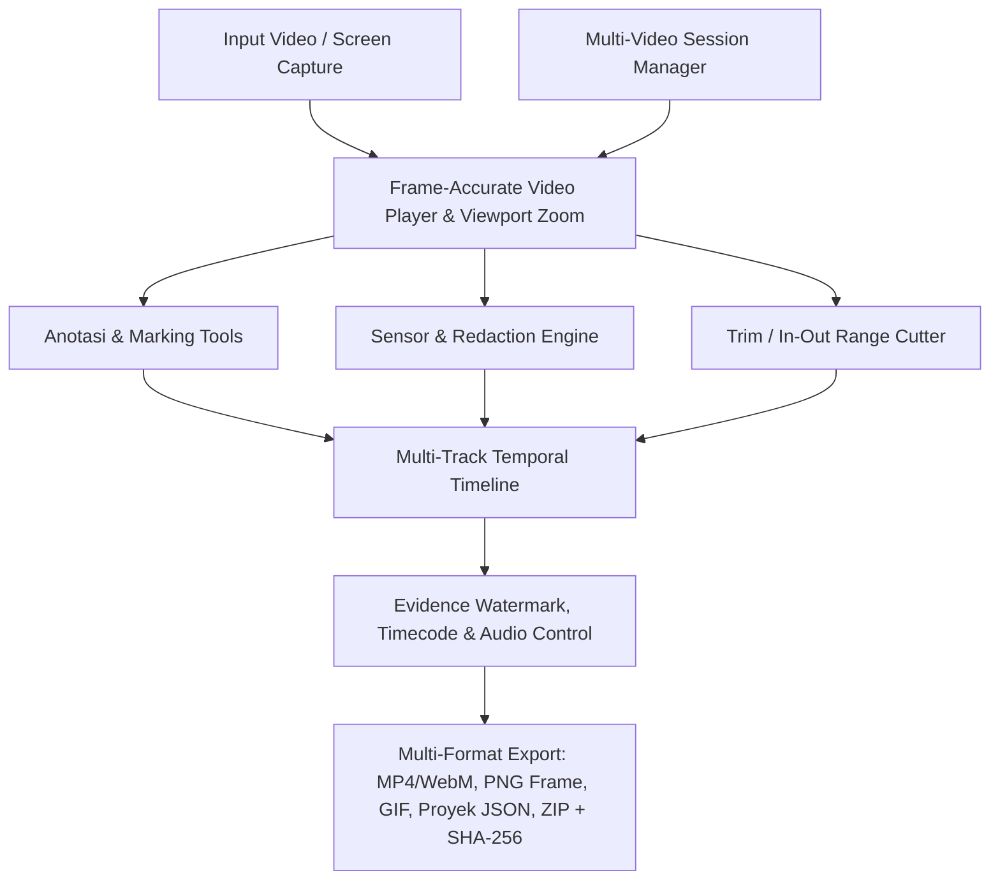
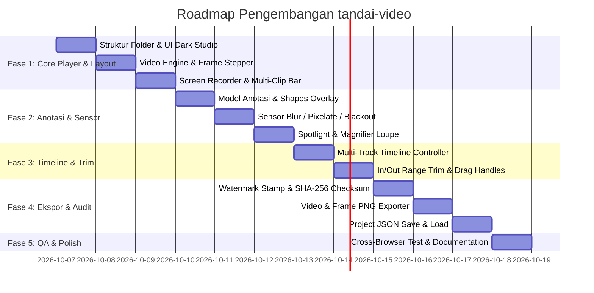

# Product Requirement Document (PRD) - `tandai-video` (Web-based Video Evidence Marker & Redaction Tool)

| Metadata | Keterangan |
|---|---|
| **Nama Proyek** | `tandai-video` |
| **Kategori** | Productivity / QA & Security Tooling / Evidence Marker |
| **Platform** | Web (100% Client-Side, Zero Backend, Privacy-First) |
| **Sister Project** | [`tandai-ss`](../tandai-ss) (Evidence Marker untuk Screenshot Gambar) |
| **Status Dokumen** | **Comprehensive & Complete / Ready for Execution** |
| **Versi Dokumen** | **v1.2 (Final Gold Specification)** |
| **Tanggal Dibuat** | 7 Oktober 2026 |
| **Author** | Antigravity Pair-Programmer & Hanif Al-Kauni |

---

## 1. Executive Summary & Problem Statement

### 1.1 Latar Belakang
Pada alur kerja **Software QA/QC, Security Incident Response, Audit Kepatuhan, dan Technical Support**, bukti berupa rekaman video (*screen recording*) sering kali menjadi kebutuhan krusial untuk mendokumentasikan:
- Bug yang bersifat *intermittent* atau dinamis (animasi, transisi UI, *race condition*, *network latency glitch*).
- Rangkaian alur langkah pengguna (*User Journey*) yang panjang dan bertahap.
- Bukti insiden keamanan, kebocoran data (*data leak*), atau kecurangan sistem.

Namun, editor video konvensional (Adobe Premiere, After Effects, CapCut, DaVinci Resolve) menghadapi kendala:
1. **Terlalu Berat & Rumit**: Memerlukan spesifikasi PC tinggi dan *learning curve* yang berlebihan hanya untuk memberi kotak merah, panah, dan sensor data.
2. **Risiko Privasi & Regulasi**: Editor video online berbasis *cloud* mewajibkan video diunggah ke server pihak ketiga, berisiko melanggar GDPR, UU PDP, dan kebocoran kredensial/PII.
3. **Ketiadaan Fitur Khusus Bukti**: Tidak ada penomoran langkah berurutan dinamis (*Step Badges*), stempel tiket formal (*Audit Watermark*), dan verifikasi integritas berkas (*SHA-256 Checksum*).

### 1.2 Solusi: `tandai-video`
`tandai-video` adalah aplikasi web statis modern, ringan, dan **100% Client-Side** yang dirancang khusus untuk menandai (*mark*), menganotasi, menyensor (*redact*), memotong (*trim*), dan membubuhkan stempel bukti pada video rekaman layar secara instan, aman, dan tanpa instalasi backend.

---

## 2. Tujuan, Persona & Batasan Cakupan (Scope)

### 2.1 Tujuan Utama
- **Kecepatan & Kemudahan**: Menganotasi video 5 detik hingga 10 menit dalam hitungan detik langsung di peramban.
- **Privasi Mutlak**: 100% proses pemrosesan berjalan di browser lokal pengguna (*Zero-data sent to network*).
- **Integritas Forensik Bukti**: Menyediakan metadata tiket formal, *burn-in timecode*, stempel auditor, dan manifest verifikasi hash SHA-256.
- **Konsistensi & Portabilitas**: Menjaga keselarasan desain dan *shortcuts* dengan `tandai-ss`, serta mendukung format proyek `.tandaivideo` (JSON) untuk kolaborasi tim.

### 2.2 Persona Pengguna
1. **QA / Test Engineer**: Melampirkan klip video bug di Jira/GitHub dengan kotak merah, panah, nomor langkah alur, dan sensor data akun uji coba.
2. **Security / SOC Analyst**: Membuat *Proof of Concept* (PoC) kerentanan atau mendokumentasikan insiden keamanan dengan sensor password, token, dan PII.
3. **Auditor & Compliance Officer**: Mendokumentasikan bukti kepatuhan sistem dengan stempel waktu presisi dan manifest integritas SHA-256.
4. **Customer Support / Technical Writer**: Membuat tutorial ringkas atau klip panduan visual dengan sorotan spotlight dan catatan penjelasan.

### 2.3 Batasan Cakupan (In-Scope vs Out-of-Scope)

| In-Scope (v1.0) | Out-of-Scope (v1.0) |
|---|---|
| Ingest file video lokal (.mp4, .webm, .mov) & Screen Recording | Cloud storage upload / Multi-user real-time web socket |
| Anotasi temporal 2D (Kotak, Panah, Teks, Step, Highlight, Blur, Spotlight, Loupe) | 3D visual effects atau AI auto-motion tracking |
| Multi-track timeline, scrubber, & Trim in/out range | Multi-layer video composite blending (Chroma key/Green screen) |
| Watermark tiket audit, burn-in timecode, dan SHA-256 manifest | Dubbing audio multi-track atau Voice-over generator |
| Ekspor Video (MP4/WebM), Frame PNG snapshot, GIF, & Proyek JSON | Fitur transisi sinematik video (Dissolve, Wipe, 3D Page Turn) |

---

## 3. Fitur Utama & Spesifikasi Fungsional (Functional Requirements)



### 3.1 Input, Perekaman & Multi-Video Session (Media Ingestion)
- **FR-1.1 File Drag & Drop / Picker**: Mendukung format `.mp4`, `.webm`, `.mov`, `.mkv` (codec H.264, VP8/VP9, AV1).
- **FR-1.2 Perekam Layar Bawaan (Built-in Screen Recorder)**: Tombol "Rekam Layar" menggunakan `navigator.mediaDevices.getDisplayMedia()` dengan opsi rekam seluruh layar, jendela, atau tab peramban. Rekaman langsung dimuat ke kanvas saat selesai.
- **FR-1.3 Multi-Video Session Switcher**: Bilah thumbnail klip video di bagian bawah/samping untuk mengelola beberapa video rekaman sekaligus dalam satu sesi pengujian QA (seperti pada `tandai-ss`).
- **FR-1.4 Paste dari URL / Blob**: Mendukung pembukaan file video lokal atau URL blob instan.

### 3.2 Pemutar Video Presisi Frame & Viewport Zoom
- **FR-2.1 Navigasi Playhead & Scrubbing**: Scrubber interaktif dengan indikator timecode ganda: `HH:MM:SS:FF` (Timecode + Frame) dan `MM:SS.mmm` (Milidetik).
- **FR-2.2 Navigasi Frame-by-Frame**: 
  - Maju 1 Frame (`.` / `>`)
  - Mundur 1 Frame (`,` / `<`)
  - Lompat 1 detik / 5 detik (`ArrowLeft` / `ArrowRight` / `Shift + Arrow`)
  - Salin Timecode Aktif ke Clipboard (`Shift + C` atau tombol klik timecode).
- **FR-2.3 Kontrol Kecepatan Playback**: `0.25x`, `0.5x`, `1.0x`, `1.5x`, `2.0x` dengan *pitch preservation*.
- **FR-2.4 Sinkronisasi Render Kanvas**: Menggunakan `requestVideoFrameCallback` (dengan *fallback* `requestAnimationFrame` + `timeupdate`) untuk sinkronisasi mutlak antara frame video dan kanvas anotasi.
- **FR-2.5 Zoom & Pan Viewport**: Pengguna dapat memperbesar tampilan video dari **25% hingga 400%** (`Ctrl + Scroll` atau `+` / `-`) dan menggeser (*pan*) dengan `Space` + drag untuk menandai detail kecil pada resolusi tinggi (1080p/4K).

### 3.3 Pemotongan Klip (Trim / In-Out Range)
- **FR-3.1 Set In-Point (`I`) & Set Out-Point (`O`)**: Memilih rentang waktu spesifik untuk membuang bagian rekaman yang tidak relevan.
- **FR-3.2 Visual Range Selector**: Area berwarna di timeline dengan *draggable start/end handles*.
- **FR-3.3 Loop Playback Range**: Memutar ulang (*loop*) hanya pada segmen yang di-*trim*.

### 3.4 Sistem Anotasi Temporal (Time-Ranged Markings)
Setiap objek anotasi memiliki rentang waktu aktif: $[t_{start}, t_{end}]$. Anotasi hanya dirender di kanvas saat playhead berada dalam rentang tersebut.

| Tool | Shortcut | Fungsi & Karakteristik |
|---|---|---|
| **Select / Move / Resize (`V`)** | `V` | Memilih objek di kanvas/timeline, menggeser posisi, mengatur bounding box & rotasi panah. |
| **Kotak (`R`)** | `R` | Kotak penanda elemen/area. Style: Outline, Semi-transparan (Soft Fill), Solid. |
| **Elips / Lingkaran (`O`)** | `O` | Penanda fokus titik klik atau status. Mendukung kunci proporsi 1:1 (`Shift`). |
| **Panah (`A`)** | `A` | Menunjuk pesan error atau elemen spesifik dengan kepala panah otomatis & snap 45°. |
| **Highlighter (`H`)** | `H` | Stabilo semi-transparan kuning/kustom untuk menyorot teks log atau baris tabel. |
| **Teks Callout (`T`)** | `T` | Label keterangan teks dengan background box, border, dan ukuran font dinamis. |
| **Nomor Langkah (`N`)** | `N` | Badge nomor langkah otomatis (1, 2, 3...) yang muncul pada detik/momen tertentu. |
| **Sensor Data (`B`)** | `B` | Sensor data sensitif dengan 3 mode: **Pixelate**, **Gaussian Blur**, dan **Solid Blackout**. |
| **Spotlight Dimmer (`S`)** | `S` | Meredupkan seluruh layar (overlay gelap 70%) kecuali area fokus lingkaran/kotak. |
| **Magnifier Loupe (`M`)** | `M` | Lensa pembesar (2x/4x) pada area lingkaran/kotak untuk memperjelas detail UI/kode. |

### 3.5 Timeline Multi-Track Visual
- **FR-5.1 Track List & Marker Blocks**: Visualisasi balok durasi tiap objek anotasi di bawah video scrubber.
- **FR-5.2 Drag & Trim Handle**: Mengubah durasi kemunculan anotasi dengan menarik ujung kiri/kanan balok, atau menggeser seluruh balok ke detik lain.
- **FR-5.3 Quick Jump to Marker**: Klik pada item di timeline atau inspector langsung memindahkan playhead ke awal kemunculan objek ($t_{start}$).
- **FR-5.4 Track Visibility & Lock**: Opsi sembunyikan (*hide*) atau kunci (*lock*) objek agar tidak sengaja teredit.

### 3.6 Pengaturan Audio (Audio Passthrough / Mute)
- **FR-6.1 Toggle Audio Mute**: Opsi untuk mematikan audio asli rekaman saat ekspor (penting jika ada suara latar atau percakapan pribadi).
- **FR-6.2 Audio Preservation**: Jika diaktifkan, audio asli tetap disinkronkan ke video hasil ekspor.

### 3.7 Stempel Bukti Formal (Evidence Watermark & Audit Stamp)
- **FR-7.1 Konfigurasi Metadata Stempel**:
  - No. Tiket / Referensi (Contoh: `BUG-4091`, `INC-2026-081`).
  - Nama Penguji / Auditor (Contoh: `QA Team / Hanif`).
  - Waktu Pengambilan / Tanggal dengan zona waktu (WIB/UTC).
  - Nama File Asli Video.
- **FR-7.2 Burn-in Timecode & Frame Counter**: Pilihan membubuhkan cap timecode dinamis (`TC 00:00:04.18 | Frame #125`) di pojok video.
- **FR-7.3 Penempatan Stempel**: Sudut Kiri-Atas, Kanan-Atas, Kiri-Bawah, atau Kanan-Bawah.

### 3.8 Ekspor Multi-Format, Proyek JSON & Integritas Bukti
- **FR-8.1 Ekspor Video Beranotasi (MP4 / WebM)**:
  - Menggunakan Canvas Stream + WebCodecs / MediaRecorder client-side.
  - Membakar (*burn-in*) seluruh anotasi, sensor, stempel, dan rentang trim yang dipilih.
  - Opsi *Deterministic Offline Frame Render* untuk mencegah *frame drop* saat CPU sedang sibuk.
- **FR-8.2 Tangkap Frame Aktif (Frame Snapshot PNG / Clipboard)**:
  - 1-klik untuk mengekspor frame saat ini beserta anotasinya sebagai gambar PNG resolusi penuh atau salin langsung ke Clipboard (`Ctrl+C`).
- **FR-8.3 Ekspor GIF Animasi**:
  - Ekspor klip pendek (1-10 detik) ke format `.gif` untuk kemudahan preview di Jira / PR GitHub tanpa perlu media player.
- **FR-8.4 Simpan & Buka Proyek (`.tandaivideo` JSON)**:
  - Ekspor/import konfigurasi proyek (daftar anotasi, durasi, watermark) agar pekerjaan dapat dilanjutkan atau dibagikan ke anggota tim.
- **FR-8.5 Paket Arsip Bukti (ZIP + SHA-256 Manifest)**:
  - Mengemas file video hasil anotasi, snapshot gambar penting, metadata JSON proyek, dan file `manifest.txt` berisi hash kriptografi SHA-256 untuk menjamin keaslian bukti (*chain of custody*).

---

## 4. Kebutuhan Non-Fungsional (Non-Functional Requirements)

| Kategori | Spesifikasi |
|---|---|
| **NFR-1 Performa Playback** | Render kanvas overlay stabil pada 60 FPS saat playback, latensi scrubbing < 50ms. |
| **NFR-2 Manajemen Memori** | Menggunakan `Blob` dan `URL.createObjectURL` dengan pelepasan memori via `URL.revokeObjectURL`. Video hingga 4K ditangani secara efisien. |
| **NFR-3 Privasi & Keamanan** | 100% Client-Side. Tidak ada library external berbahaya atau pengiriman telemetri data keluar. |
| **NFR-4 Kompatibilitas Browser** | Berjalan di Chrome, Edge, Firefox, Safari (Chromium-based direkomendasikan untuk WebCodecs/Screen Recorder). |
| **NFR-5 High-DPI Display** | Dukungan `window.devicePixelRatio` otomatis agar rendering garis dan teks anotasi tetap tajam di layar Retina/4K. |
| **NFR-6 Auto-Save / Draft Recovery** | Konfigurasi anotasi otomatis tersimpan sementara di `localStorage`/`IndexedDB` untuk mencegah kehilangan data jika tab tertutup tidak sengaja. |

---

## 5. Spesifikasi Struktur Data (Data Schema)

File proyek disimpan dalam format JSON standar (`.tandaivideo`):

```json
{
  "version": "1.0.0",
  "project": {
    "title": "Bug Report - Checkout Glitch",
    "createdAt": "2026-10-07T10:15:00.000Z",
    "videoMeta": {
      "fileName": "screen_recording_001.mp4",
      "duration": 14.85,
      "width": 1920,
      "height": 1080,
      "fps": 60
    },
    "trim": {
      "inPoint": 2.50,
      "outPoint": 11.20
    },
    "watermark": {
      "enabled": true,
      "ticket": "BUG-4091",
      "author": "Hanif Al-Kauni",
      "position": "bottom-right",
      "showTimecode": true
    },
    "audio": {
      "muteOnExport": false
    },
    "annotations": [
      {
        "id": "ann-172829001",
        "type": "rectangle",
        "tStart": 2.50,
        "tEnd": 6.80,
        "x": 320,
        "y": 180,
        "width": 240,
        "height": 120,
        "style": {
          "strokeColor": "#ff4d4f",
          "strokeWidth": 3,
          "fillType": "soft",
          "fillOpacity": 0.2
        }
      },
      {
        "id": "ann-172829002",
        "type": "redact",
        "redactMode": "blur",
        "blurRadius": 16,
        "tStart": 3.00,
        "tEnd": 9.50,
        "x": 800,
        "y": 450,
        "width": 300,
        "height": 60
      },
      {
        "id": "ann-172829003",
        "type": "step",
        "stepNumber": 1,
        "tStart": 2.50,
        "tEnd": 5.00,
        "x": 300,
        "y": 160,
        "style": {
          "badgeColor": "#1890ff"
        }
      }
    ]
  }
}
```

---

## 6. Arsitektur Teknis & Struktur Proyek

### 6.1 Desain Arsitektur (Zero-Build Modular Architecture)
Sesuai standar performa dan kemudahan pemeliharaan, `tandai-video` dibangun menggunakan **Pure Vanilla ES6+ HTML5/CSS3** modular tanpa ketergantungan framework yang rumit.

```
tandai-video/
├── index.html               # Struktur UI shell, kanvas viewport, timeline, dialogs
├── README.md                # Dokumentasi petunjuk penggunaan, shortcuts, & badge
├── PRD.md                   # Dokumen spesifikasi kebutuhan produk (PRD v1.2)
├── LICENSE                  # MIT License
├── css/
│   ├── style.css            # Token desain (Dark/Light mode), layout grid & utility
│   ├── timeline.css         # Styling multi-track timeline, scrubber, & trim handles
│   └── components.css       # Styling toolbar, property inspector, dialog & modals
└── js/
    ├── model.js             # Data model: Annotation, ProjectSession, Multi-Clip Playlist, History Undo/Redo
    ├── video-engine.js      # Video controller, screen recorder API, time sync, frame stepper
    ├── render.js            # Canvas rendering engine (shapes, blur, pixelate, watermark, magnifier)
    ├── timeline.js          # Controller timeline interaktif (drag, resize duration, scrub bar)
    ├── export.js            # Video recorder/muxer, Frame snapshot PNG, GIF, ZIP + SHA-256
    └── app.js               # Main Controller, event listener, shortcut bindings, UI state
```

---

## 7. Antarmuka Pengguna (UI / UX Layout)

Aplikasi mengusung antarmuka bergaya **Studio Gelap Profesional (Dark Slate Studio)** dengan rasio kontras tinggi dan tata letak ergonomis:

```text
┌─────────────────────────────────────────────────────────────────────────────────────────────────────────┐
│ [Logo] tandai-video  │ [Open Video] [Record Screen] │ [Project: Load/Save] │ [Watermark] │ [Export ▾]  │
├─────────────────────────────────────────────────────────────────────────────────────────────────────────┤
│ TOOLBAR (Left)  │                               CANVAS VIEWPORT                          │ INSPECTOR    │
│ [ V ] Select    │ ┌────────────────────────────────────────────────────────────────────┐ │ [Properties] │
│ [ R ] Rectangle │ │                                                                    │ │ Type: Redact │
│ [ O ] Ellipse   │ │                 Video Stream + Canvas Layer                        │ │ Mode: Blur   │
│ [ A ] Arrow     │ │                                                                    │ │ Time:        │
│ [ H ] Highlight │ │   [ #1 Step 1 ]               [ === REDACT BLUR === ]              │ │  In:  03.0s  │
│ [ T ] Text      │ │                                                                    │ │  Out: 09.5s  │
│ [ N ] Step No   │ │                                                                    │ │ Blur: 16px   │
│ [ B ] Redact    │ │                                                                    │ │ [Delete]     │
│ [ S ] Spotlight │ └────────────────────────────────────────────────────────────────────┘ │              │
│ [ M ] Magnifier │ Controls: [|<] [<<] [ Play/Pause ] [>>] [>|]  [00:03.00 / 00:14.85] [1.0x] [Vol/Mute] │
├─────────────────┴──────────────────────────────────────────────────────────────────────┴────────────────┤
│ TIMELINE & TRACKS (Bottom)                                                                              │
│ Playhead: -------------------------◆--------------------------------------------------------------------│
│ Video Trim: [====== IN ============================================== OUT ===============]              │
│ Track 1 (Redact Blur):             [=============================]                                      │
│ Track 2 (Step #1)    :      [=============]                                                             │
│ Track 3 (Arrow)      :                             [============== ]                                    │
│ MULTI-CLIP BAR: [ Clip 1: Login Bug (Active) ] [ Clip 2: Error Modal ] [ + Add Clip ]                   │
└─────────────────────────────────────────────────────────────────────────────────────────────────────────┘
```

---

## 8. Daftar Pintasan Keyboard (Keyboard Shortcuts)

| Shortcut | Aksi |
|---|---|
| `Space` | Play / Pause video |
| `.` atau `>` | Maju 1 frame |
| `,` atau `<` | Mundur 1 frame |
| `ArrowLeft` / `ArrowRight` | Lompat mundur / maju 1 detik (`Shift` untuk 5 detik) |
| `Shift + C` | Salin Timecode Aktif (`HH:MM:SS:FF`) ke clipboard |
| `I` | Set Trim In-Point (titik awal klip) |
| `O` | Set Trim Out-Point (titik akhir klip) |
| `V` | Mode Seleksi / Pilih Objek |
| `R` | Alat Kotak (Rectangle) |
| `O` (saat mode tool) | Alat Elips (Circle/Ellipse) |
| `A` | Alat Panah (Arrow) |
| `H` | Alat Highlighter |
| `T` | Alat Teks |
| `N` | Alat Nomor Langkah (1, 2, 3...) |
| `B` | Alat Sensor (Blur / Pixelate / Hitam) |
| `S` | Alat Spotlight |
| `M` | Alat Kaca Pembesar (Magnifier Loupe) |
| `Ctrl + C` | Salin frame aktif beranotasi ke Clipboard |
| `Ctrl + S` | Simpan frame aktif sebagai gambar PNG |
| `Ctrl + E` | Buka menu Ekspor Video / Paket Bukti |
| `Ctrl + Z` / `Ctrl + Y` | Undo / Redo perubahan anotasi |
| `Delete` / `Backspace` | Hapus objek anotasi yang dipilih |
| `Shift` (tahan saat gambar) | Kunci aspek rasio persegi/lingkaran atau snap sudut panah 45° |
| `Space` (tahan + drag) | Pan / Geser kanvas video saat zoom aktif |
| `Ctrl + Scroll` | Zoom in / Zoom out viewport video |

---

## 9. Penanganan Kasus Khusus & Edge Cases

1. **Codec Video Tidak Didukung**: Jika format video tidak dapat di-decode oleh peramban, tampilkan modal peringatan yang ramah dan instruksi konversi singkat ke H.264/WebM.
2. **Pembatalan Izin Rekam Layar**: Jika pengguna membatalkan dialog *Screen Share*, tangani secara *graceful* tanpa error di konsol.
3. **Penyusutan Rentang Trim**: Jika in-point diatur melebihi out-point (atau sebaliknya), sistem otomatis menyesuaikan nilai batas (*clamping*) untuk mencegah *invalid time range*.
4. **Perubahan Ukuran Window (Responsive Resize)**: Koordinat anotasi dinormalisasi berbasis resolusi asli video $(W \times H)$, sehingga tidak akan bergeser saat ukuran jendela peramban berubah.

---

## 10. Metrik Keberhasilan (Success Metrics / KPIs)

| Metrik | Target Keberhasilan |
|---|---|
| **Waktu Pemuatan Aplikasi** | < 1 detik untuk inisialisasi awal UI |
| **Kinerja Render Playback** | Stabil 60 FPS tanpa lag saat memainkan video 1080p dengan 10+ anotasi |
| **Kecepatan Ekspor Frame PNG** | < 200 ms untuk 1 frame snapshot resolusi penuh |
| **Kecepatan Ekspor Video Klip** | < 5 detik untuk klip video 10 detik pada perangkat standar |
| **Tingkat Keberhasilan Verifikasi SHA-256** | 100% konsisten antara file ekspor dan catatan `manifest.txt` |
| **Kepatuhan Privasi Data** | 0 request data keluar ke internet (100% Client-Side Air-Gapped) |

---

## 11. Rencana Tahapan Pengembangan (Implementation Roadmap)



### Kriteria Selesai (Definition of Done):
- [x] Dokumen PRD v1.2 lengkap, tervalidasi struktural, dan terverifikasi menyeluruh.
- [ ] Pengguna dapat memuat satu atau beberapa video (multi-clip session) dan merekam layar secara langsung.
- [ ] Pengguna dapat menavigasi video frame-by-frame, mengatur kecepatan playback, dan zoom/pan kanvas.
- [ ] Pengguna dapat menambahkan semua jenis anotasi (Kotak, Panah, Teks, Step 1-2-3, Highlighter, Spotlight, Magnifier) dan sensor data (Blur/Pixel/Blackout) dengan durasi temporal kustom.
- [ ] Pengguna dapat memotong video (trim in/out) secara visual di timeline.
- [ ] Pengguna dapat mengekspor video beranotasi (MP4/WebM), frame snapshot (PNG), dan paket ZIP + SHA-256.
- [ ] Proyek dapat disimpan dan dibuka kembali via file JSON `.tandaivideo`.
